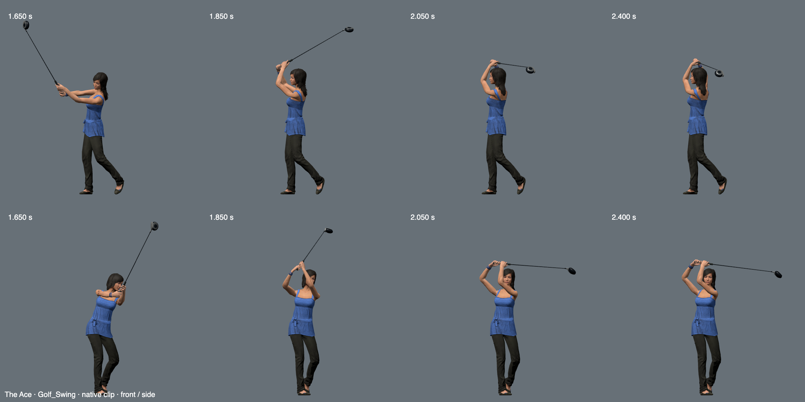
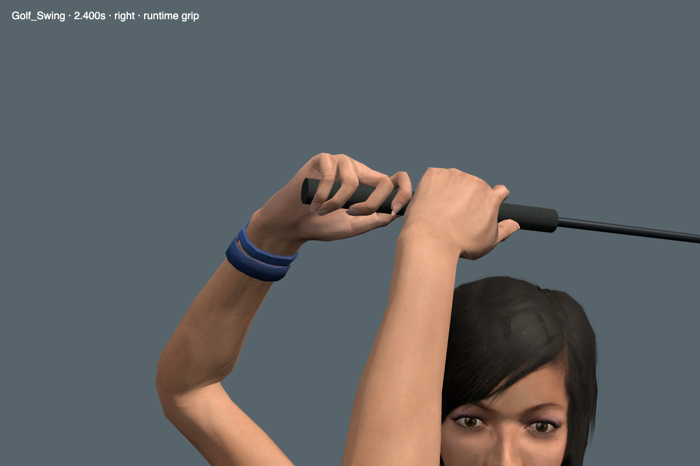

# Ace golf finish

The Ace now completes the swing with folded arms, a fuller chest turn, and the club passing behind the head.
The previous finish left the shaft raised in front of the head.
The change starts after 1.68 seconds. It preserves the lower body, address, ball contact, and club length.

## Reference and independent review

The fitting uses the supplied John Baker golf sequence and CMU subject 64, trial 64_01, frame 409.
The CMU pose was mirrored for the game's left-handed swing and refitted to the native skeleton.
The capture has no club or usable finger tracking. It cannot establish the grip by itself.

Claude Opus 5.5 High reviewed the published pose, the candidate, and close views of both hands.
The returned model identifier was `claude-opus-5-5`; the review reported no permission denials.
It judged the finish closer to the reference and found no new visible anatomical error.
This was a still-image review. It did not establish motion quality.

## Checks

- Dense native anatomy: 6,607 samples passed the existing joint and complete hand-frame limits.
- Maximum palm-frame position error: 0.136 mm. Maximum frame mismatch: 0.013 degrees.
- Complete head, arm, hand, grip, and shaft surfaces: 1,077 finish samples, with no crossings and at least 5 mm clearance.
- Existing foot support, toe contact, forearm/body clearance, and elbow fold checks passed.
- Final 0.3 seconds: head travel 7.56 degrees; shaft travel 7.71 degrees.
- Maximum elbow speed after 1.8 seconds: 2.45 m/s. The new regression rejects discontinuous finish fits.
- Browser grip and club checks: 150 phases across six heroes, including twelve finite clubface contacts.
- Full-speed runtime capture: 182 rendered frames over 3.001 seconds, about 60.6 FPS, with no browser errors.

The capture used two fixed cameras and muted Chrome in an isolated test scene.
This frame rate does not measure a full course with enemies.
The full-speed capture and sampled playback frames also include the transition into the finish.

Release verification passed all 533 unit checks and the production build.
Browser checks covered 108 golf leg frames, all eight clubs, and six complete character preview loops.
Preview framing passed five desktop sizes with the animation console open and closed, plus all four course themes.
Development and production playback matched across 2,394 samples and 3,280,528 transform values; rendered pixel comparisons also matched.

A separate Crane Coast combat sample used the Ace, repeated attacks, and 24 active enemies.
At 1440 × 900, balanced quality, and pixel ratio 1, it averaged 60.1 FPS over seven seconds.
The 95th-percentile frame time was 16.7 ms. Chrome reported no page errors.
This is one local hardware sample, not a minimum performance guarantee for every course or device.

The release asset differs from the reviewed candidate by less than 0.00001 degrees per sampled rotation.
It preserves 8,292 unrelated animation channels and the complete original binary payload.
The maximum early-swing difference is below 0.00002 degrees, from float conversion.
The rebuild source and curves are in [tools/golf-finish](../../tools/golf-finish/README.md).

## Open grip issue

The lead hand still looks too much like a clamp at the handle's end from some close angles.
The published model shows the same problem. This finish does not change finger geometry or the grip profile.
Opus correctly flagged this despite the existing contact tests passing.

Those tests check nearest contact for each finger against an infinite cylinder.
They do not require a broad contact patch or confirm contact lies within the finite rubber handle.
The next grip pass must measure those properties and improve the visible grasp.
Passing the existing contact tests does not establish a convincing grip.
