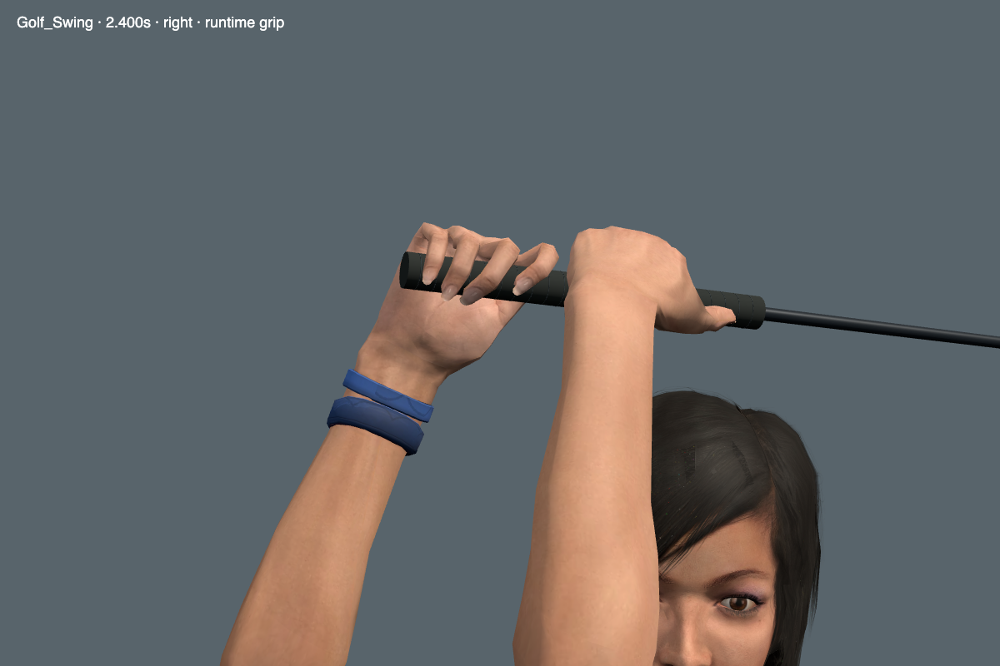
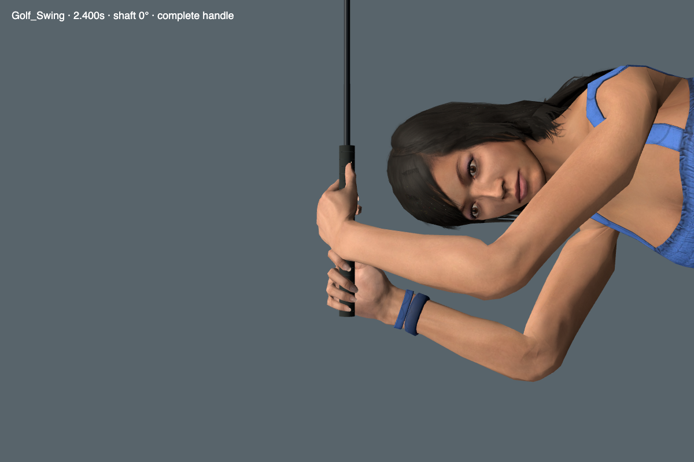

# Ace golf grasp

The Ace now holds the club farther into both hands. The fingers curl around the handle, and the lead thumb closes against it.
The native arms follow the new hand frames through address, the full swing, and putting.
This pass changes the Ace. The other heroes still need a comparable grasp review.

## Reference and review

The review used the grip photographs in [Skip Guss's Titleist lesson](https://www.titleist.com/teamtitleist/b/tourblog/posts/titleist-tips-golf-fundamental-dos-and-donts).
The photographs show the thumbs along the handle and the hands next to each other.
The game uses a left-handed, ten-finger grip. The banded right hand is the lead hand.

Claude Opus 5.5 High reviewed the old and revised hands from several angles.
The returned model identifier was `claude-opus-5-5`, with no permission denials.
It found a visible gap under an early candidate's lead thumb. The final fit closes that gap.
It accepted the final result as an incremental improvement and found no clear new joint distortion.

The reviewer could not confirm the complete finger wrap from one oblique view.
Four additional cameras looked perpendicular to the shaft, with both handle ends in view.
These views and the finite-handle contact check confirmed that all five digits contact the handle.
Opus also confirmed the lead finger wrap stays inside both handle ends in the perpendicular views.

The fingers still spread more than the reference. Contact checks do not establish a broad pressure patch or prove a perfect grip.
The lead elbow has about 14.5 degrees of bend at address. This remains within the current joint limits, but is not fully straight.

## Changes

- Refit the finger hinges and thumbs against the actual skinned surfaces.
- Refit eight native arm rotation channels in each of the three golf clips.
- Preserve the club path and check the complete hand frames between authored samples.
- Recalculate the Ace's preview bounds and change its model revision to invalidate the old cache entry.
- Add finite-handle, hand-to-hand, and digit-to-digit collision checks.
- Add candidate grip routing and perpendicular handle views to the review tools.

The model retains its geometry, skin weights, textures, original binary payload, and 8,279 unrelated animation channels.
The change adds 250,760 bytes to the model. It adds no runtime fitting loop.

## Validation

- Native anatomy: 6,607 samples across keys, midpoints, and a 480 Hz grid.
- Maximum wrist angle: 29.98 degrees. No reversed elbow flexion.
- Maximum hand-frame position error: 0.168 mm. Maximum frame mismatch: 0.015 degrees.
- Finite handle: 181 poses, all ten digits in contact, no hand or digit surface crossings.
- Maximum triangle penetration into the handle: 1.002 mm, within the 1.5 mm surface tolerance.
- Runtime vertex contact: existing 0.8 mm penetration limits pass without changes.
- Finish clearance: 1,077 poses keep arms, hands, grip, and shaft at least 5 mm from the head.
- Browser golf: 150 phases across six heroes, including twelve finite clubface contacts.
- Equipment: all eight club models, face normals, necks, and stance checks pass.
- Selection: all six preview cycles, speed and pause controls, ten desktop layouts, and four course themes pass.
- Full regression suite: all 534 checks pass in an isolated copy of the release source.
- Production build passes. The existing large-bundle warning remains.

[Full-speed runtime playback](media/ace-golf-grasp.webm) uses two fixed cameras with audio muted.
It averaged 60.6 FPS over 3.004 seconds, with 182 rendered frames and no page errors.
This isolated scene does not establish a minimum frame rate during course combat.

## Rebuild

The accepted curves and both hand profiles are in [the grasp record](../../tools/golf-grasp/README.md).
The rebuild requires the exact source assets from `d3ea945` and rejects changed input hashes.
It writes the model and grip profiles together into a new candidate directory.
