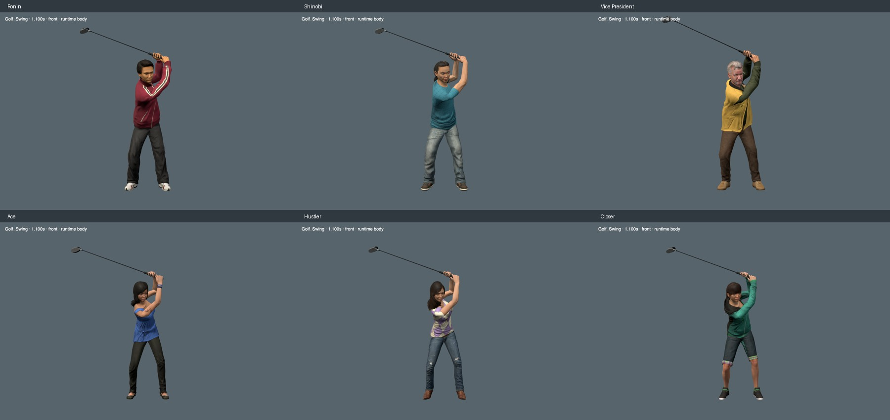

# Golf backswing correction

All six heroes now fold the trail arm and set the club across their shoulders at the top.
The previous motion extended both elbows near the top and left the shaft almost vertical.
The new shaft elevation is about 20–23 degrees at 1.05 seconds.
The existing chest rotation supplies the body turn; the correction does not add more torso rotation.

[Vice President swing at normal speed](media/golf-backswing-vp.webm)

## Reference and fitting

The hand-center and elbow-plane references come from CMU subject 64, trial 64_01, frames 180–330.
The John Baker sequence supplied by the user guides the visual review.
The game uses a left-handed swing: native right arm leads, native left arm trails.
The source motion is mirrored and scaled by each character's arm reach.
It is one human reference, not a perfect professional swing.

The fit preserves both complete palm frames on one rigid club frame.
Native hinge calibration constrains elbow direction, wrist flexion, and arm rotation.
Elbow guides interpolate through rotation of the bend plane.
A later midpoint pass preserves the paired grip between the fitted keys.

Only eight Golf_Swing rotation channels change: both clavicles, upper arms, forearms, and hands.
The correction acts between 0.58 and 1.38 seconds.
It preserves the existing torso, legs, head, fingers, address, ball contact, and finish.
The asset audit preserves 49,789 other animation channels and the complete source binary payload.
Geometry, weights, materials, and other clips remain unchanged.
The largest rotation difference outside the correction window is below 0.00001 degrees.
Each model grows by about 255 KB. No fitting runs during play.

The reproducible curves and rebuild instructions are in [tools/golf-backswing](../../tools/golf-backswing/README.md).
The builder verifies source and output hashes for all six models from commit `ce08de7`.

## Sleeve and hood corrections

The Vice President uses a shallower trail-elbow fold, about 80 degrees at the top, for his loose sleeve.
The previous sleeve fixture permitted a radial overlap proxy up to 27.3 mm.
The revised motion measures zero in that proxy over 745 samples, including native keys, midpoints, and a 480 Hz grid.
The new limit is 1 mm, and it permits no interior witness vertices.

The inner cloth crease retains five simultaneous crossing face pairs and six unique pairs across the inspected interval.
The fixture permits only those specific pairs, only between frames 23 and 30.
It also bounds each edge/face intersection segment independently of the radial vertex test.
The longest segment measures 34.75 mm along the crease; the other segments are below 3.51 mm.
Those values measure intersection length, not penetration depth.
The permitted lengths add 0.5 mm to the measured maxima.
The existing sleeve-radius and axial-position checks remain in place.

The Closer's hood briefly crossed her hair in an earlier candidate.
A smooth 9.17-degree trail-clavicle correction removes the crossing.
The arm solver restores the original wrist target and complete hand orientation after the clavicle correction.
The final model changes no garment geometry or weights.

## Verification

- All six models pass about 7,800 native joint and paired-grip samples each.
- Every character passes more than 2,230 actual-surface samples around the backswing.
- The complete arm, hand, shaft, and grip surfaces have no crossings with the skinned head, neck, or hair.
- These scans retain at least 5 mm clearance, capped at 5 mm by the measuring tool.
- All ten fingers retain contact with the finite handle over 181 sampled golf poses per character.
- The hands and fingers do not cross each other; handle penetration stays below the existing 1.5 mm tolerance.
- The runtime browser check passes 150 golf phases and twelve finite clubface contacts.
- All eight club types pass their runtime checks. The 108 golf leg samples retain their contact and joint limits.
- All six preview cycles pass, including the C console, speed control, pause, and resume.
- Preview framing passes ten desktop layouts and all four course themes with the rebuilt bounds.
- All six rebuilds match the reviewed model bytes exactly.
- The clean release passes all 558 unit tests and the production build.

The Vice President's normal-speed, two-camera runtime capture averaged 60.6 FPS locally.
This is an isolated preview measurement, not a full-course combat benchmark.

## Independent review and limits

Claude Opus 5.5 High reviewed the backswing poses, runtime frame sequences, close-ups, and measurements.
The responses identified `claude-opus-5-5` and reported no permission denials.
The final review found no concrete blocker for releasing the Vice President and Closer as incremental corrections.
The earlier review supported the other four characters.
Opus reviewed sampled frames, not continuous video playback.

The lead arms still bend about 38–40 degrees at the top.
They look more bent than the Baker reference and need further work.
A comment in the Opus response calls the Closer's 102-degree bend a lead-arm measurement.
The recorded side is `l`, which is the trail arm in this game; the lead arm remains near 40 degrees.

The Vice President retains a small elbow shift during the rising backswing.
His upper-arm roll reverses by about 12 degrees near 0.84–0.89 seconds while the elbow still rises.
The measured elbow displacement is about 15 mm, with a peak speed of 3.63 m/s.
Opus found no visible pop in the sampled frames, but recommended smoothing this section further.

The shoulder and chest cloth still compress around some poses.
The head-clearance checks do not establish complete body clearance or physically simulated cloth.
The Vice President's inner sleeve crease still contains bounded surface crossings.
These results establish a tested improvement, not finished animation quality.
