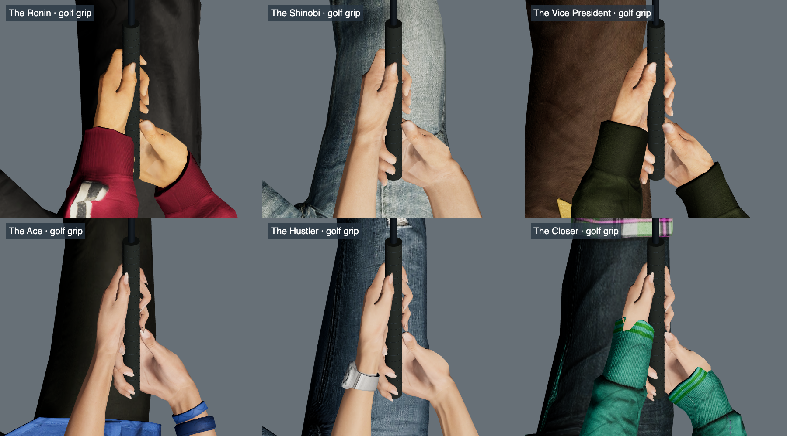

# Closed golf grips

The old 90 mm palm spacing let the two hand meshes overlap. Moving the club alone could not repair that geometry.
The revised golf profiles place the palms about 106–109 mm apart. Each profile includes both complete palm frames and all finger rotations.

Both hands follow one shared club path. Native clavicle, arm, wrist, and finger tracks preserve that relationship throughout the swing.
Additional animation keys keep the relationship stable between the original samples. They must also preserve smooth joint motion.

The club follows the lead hand's full orientation. Small support-hand interpolation errors cannot steer the calibrated clubface.
Runtime golf no longer uses the old support-arm correction during a partial animation blend.
The grip now covers both hands and the extended trail thumb.



## Motion and equipment

The putt uses a shoulder-driven pendulum. Its local arm and hand pose stays fixed.
The feet remain planted. The putter returns to its calibrated contact pose at 22/30 seconds.
The full swing contacts the ball at 1.4 seconds.

The eight clubs are driver, 3-wood, 5-iron, 7-iron, 9-iron, pitching wedge, sand wedge, and putter.
Each has its own head shape and face angle. The game fits the shaft length to the character's stance.
These fitted lengths are not a claim of standard manufactured club dimensions.

## Acceptance checks

- Native pose checks include a 480 Hz grid, every authored key, and each adjacent midpoint.
- Palm separation error must remain below 0.2 mm. Full palm-frame disagreement must remain below 0.1 degrees.
- Joint checks reject backward elbow hinges and sudden changes between closely spaced authored keys.
- Browser checks measure both hands, finger contact, all eight club heads, finite face contact, and sole clearance.
- Character selection checks cover the complete preview cycle, slow playback, pause, and resume.
- The writer verifies unchanged meshes, skin bindings, materials, and all 34 non-golf clips for each hero.

The fitter targets 30-degree wrist rotation and 70-degree arm rolls relative to the calibrated native frames.
The baked checks permit a one-degree fitting margin. These are project pose limits, not medical range-of-motion claims.

Independent surface reviews still identify folds and crossings in mixed sleeve, shoulder, and jacket geometry.
Those garment contacts do not disappear with the hand fix. Triangle counts alone cannot establish inward body penetration.
The release record keeps the reviewed garment limitations separate from the hand and equipment checks.

## Reviewed sleeve fold

Ethan's loose left sleeve folds into itself from 23/30 through 30/30 seconds.
The eight sampled frames retain a continuous outer silhouette. They still contain nine specific sleeve intersections.
The radial overlap estimate reaches 27.183 mm, but the five reviewed sleeve vertices lose at most 0.064 mm of radius.

The test keeps the existing 18 mm overlap gate elsewhere.
This narrow exception pins the two overlap vertices, nine face pairs, phase interval, and overlap envelope.
It also rejects radius loss above 1 mm or changes to the native axial positions and forearm length.
A synthetic twist at the same bend loses over 8 mm of radius and fails that test.
The exception therefore preserves the known garment fold without accepting the earlier collapsed-arm defect.

## Release validation

The complete release suite passes all 415 tests. The production build passes.
The final browser run checks 150 golf phases and 12 finite driver/putter contacts.
The separate equipment run checks all eight clubs across six heroes.
The selection preview and forearm integration checks also pass.
The writer passes 24 checks; the compact putting recipe passes seven checks.

Ethan's corrected finish has zero arm/head crossings across 178 samples from 1.8–2.4 seconds.
This includes both upper arms, both forearms, every authored key, adjacent midpoints, and a 60 Hz grid.
The smallest measured gap is 4.587 mm. The head geometry and all non-golf clips remain unchanged.

## Reproduction

The accepted complete native poses live in `tools/golf-poses/*.json.gz`.
Their manifest records the original model hashes, final model hashes, and the release baseline commit.
The gzip archives contain ordinary JSON, with complete local position, quaternion, and scale values for each native bone.

Extract the original GLB from the manifest's baseline commit. Then run:

```sh
node tools/bake-native-golf.mjs --hero kaede \
  --source /tmp/kaede-original.glb \
  --poses tools/golf-poses/kaede.json.gz \
  --output /tmp/kaede-reproduced.glb
```

The writer accepts only temporary output paths. Compare the result with the manifest before replacing a production model.
Run `node tools/check-native-golf-bake.mjs` to verify the writer's preservation and rejection checks.

The compact `tools/golf-quiet-poses` recipe separately reproduces the address and putt.

The old `author-native-golf.mjs` workflow does not reproduce these accepted paths.
Do not replace the accepted models, profiles, or paired-grip metadata with its output without a new review.
