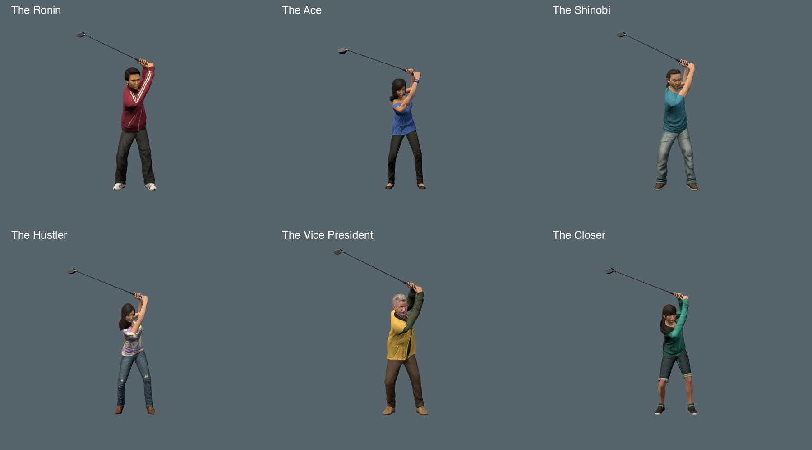

# Straighter golf lead arms

Revision 2 reduces the lead-elbow bend at the top from about 38–40 degrees to about 18 degrees.
The Vice President uses about 25 degrees to retain his sleeve clearance.
The trail elbows still fold, and both hands retain their complete grip frames on one club.

[Vice President swing at normal speed](media/golf-lead-arm-vp.webm)

## Fitting and smoothing

The reference remains the mirrored CMU 64_01 golf motion and the user's John Baker sequence.
Native right is the lead arm in this game's left-handed swing.
A uniform 120 Hz fitting schedule replaces irregular intervals as short as seven microseconds.
The fit controls the shared club frame, clavicles, and elbow planes together.

An Opus review found an elbow wobble near the top in the first candidate.
The same defect appeared to a lesser extent in the other heroes.
A 24 ms Gaussian filter now smooths the eight arm channels throughout the corrected window.
It fades in from 0.58 to 0.70 seconds and fades out from 1.26 to 1.38 seconds.
This also removes an earlier stutter found by the next independent review.
A subsequent arm solve restores both complete wrist frames on the rigid club.
All fitting and filtering happen before export, not during play.

The Vice President's trail-arm twist stays near 44 degrees at the top.
A small clavicle adjustment retains his 80-degree trail-elbow limit after filtering, with both complete wrist frames fixed.
His rising upper-arm roll now progresses without the previous reversal.
Between 0.70 and 1.10 seconds, peak elbow speed falls from 3.63 to 2.30 native metres per second.
Peak upper-arm rotation rate falls from about 870 to 536 degrees per second.
These measurements describe the reviewed motion; they are not general human movement limits.

The elbow curvature check compares each 120 Hz position with the midpoint of its two neighbours.
Across both elbows at 0.95–1.10 seconds, the final maximum is below 2.3 mm for every hero.
The first unsmoothed candidates reached 14.2 mm. The previous published models reached 8.4 mm.
The early-rise maxima, at 0.75–0.90 seconds, are below 1.9 mm for every hero.
A separate check covers the full 0.58–1.38-second correction window, including the faster downswing.
This metric detects alternating fitted poses. It does not measure penetration or isolate every source of wobble.

## Preservation

The change affects only eight `Golf_Swing` rotation channels, within 0.58–1.38 seconds.
It preserves 49,789 other animation channels, including the body, legs, head, fingers, and other clips.
Geometry, materials, skin weights, and rig bindings remain unchanged.
Outside that interval, the largest measured rotation difference from revision 1 is below 0.000006 degrees.
The address, impact, and finish retain their published motion.

Each model grows by about 127 KB relative to revision 1.
The builder uses the same `ce08de7` source to avoid retaining obsolete appended animation payloads.
All six [saved curves](../../tools/golf-backswing/README.md) reproduce their reviewed GLB files byte for byte.
The preview bounds and model revision keys also change.

## Validation

The focused checks cover the paired grip, elbow hinges, wrist limits, forearm twist, torso clearance, and sleeve deformation.
They sample about 9,700 native poses per hero and 1,305 Vice President sleeve poses.
The sleeve fixture remains unchanged; no clearance or intersection allowance increases.
New regression bounds detect excessive lead-elbow bend, alternating elbow positions, and the Vice President's previous roll reversal.

The browser checks cover 150 golf phases, both hands, and twelve finite clubface contacts.
The six selection cycles pass with the C console, speed control, pause, and resume.
The revised preview bounds pass ten desktop layouts and all four course themes.

The clean release passes all 559 unit tests and the production build.
Each hero passes more than 4,100 actual-surface poses around the backswing, with no head or neck crossings.
The Closer retains 2.40 mm minimum clearance in that scan.
The other five retain at least 5 mm, which is the scanner's reporting cap.
See the [recorded measurements](golf-lead-arm-measurements.json) for model hashes, preservation checks, and per-hero results.

## Independent review

Claude Opus 5.5 High reviewed the actual renders and native joint measurements.
It found both the top wobble and the earlier rising-elbow stutter in rejected candidates.
The final review found those defects corrected and reported no new blocking visual regression.
The review supported an incremental release conditional on those clean-release checks, which subsequently passed.
The response identifies `claude-opus-5-5` and has no permission denials.
Opus inspected sampled frames; it did not watch continuous video.

The final two-camera Vice President capture runs at about 60 FPS locally.
That is an isolated preview measurement, not a course or combat benchmark.

## Remaining work

The torso already turns substantially: about 37 degrees at the pelvis and 85–86 degrees at the upper chest in the inspected tops.
Some clothing still makes the body look less turned than its bones.
The Vice President's vest, Shinobi's sleeve, and Ace's upper-arm silhouette need further skinning work.

The club slows near impact, then accelerates again after impact in the existing source animation.
For Ace, the measured native club-tip speed is about 14.9 m/s at contact, 9.5 m/s shortly after, then 23.7 m/s.
The revised motion matches the published motion after 1.38 seconds, including that defect.
Those are native-model speeds; actor scaling changes world-space speeds.

Dense impact measurements also show small lead-arm roll reversals around 1.465 and 1.475 seconds.
They were present before this correction. The 60 Hz images hide some of that movement.
The 240 Hz images and joint measurements identify it for the next animation pass.
Neither impact timing nor release smoothness is claimed as fixed here.

Head-clearance scans test the actual arms, hands, shaft, and grip against skinned head, neck, and hair surfaces.
They do not prove complete body clearance or include rigid eyewear.
Close hair-to-shoulder contact and the Vice President's bounded inner sleeve crease remain limitations.
