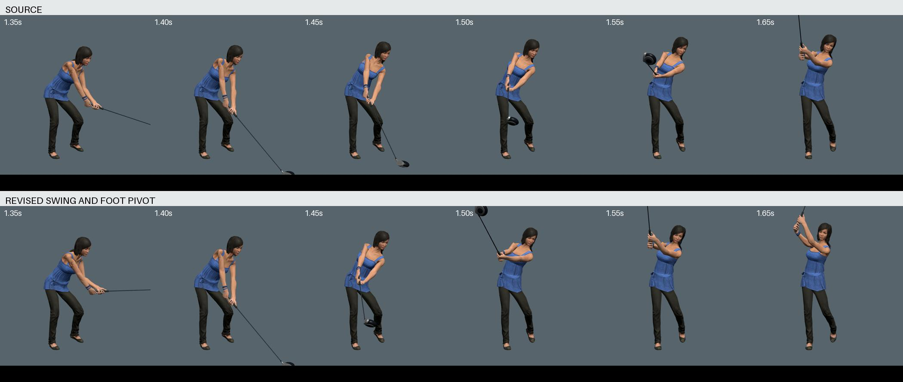

# Ace golf delivery and follow-through

The Ace now accelerates into contact and slows through the release.
The previous motion stopped briefly after impact, then accelerated again.

The change uses the released native animation as its source.
A monotonic clock follows the measured clubhead path, with contact fixed at 1.40 seconds.
The animation still lasts 2.40 seconds.

Both complete wrist frames retain the fitted grip.
The arm fit smooths the elbow roll that faster playback exposed.
The old shoulder deformation remains visible. This revision does not resolve it.

## Rear-foot correction

The first timing candidate passed the arm checks but failed the dense leg check.
It compressed the rear-foot pivot to 19.59 radians per second.
That candidate did not ship.

The final fit smooths the shoe rotations over 70 ms and solves both leg frames around their planted forefeet.
It preserves the native knee hinges and the physical shoe support plane.
The existing speed and joint limits remain unchanged.

Maximum shoe speed is 4.869 radians per second, below the existing limit of 6.
Maximum knee speed is 1.820 metres per second, below the existing limit of 4.
Knee hinge deviation stays below 0.00055 degrees.
Horizontal forefoot drift stays below 0.023 mm. Sole height drift stays below 0.006 mm.

The clip contains its own foot-support schedule.
The runtime reads that schedule once when it creates the character.
Other characters keep their existing support schedules.

## Grip and clearance

Dense native checks cover 11,113 arm samples.
Maximum palm separation error is 0.0892 mm. Complete hand-frame disagreement stays below 0.0107 degrees.
The release roll and arm-speed checks pass their previous limits.

The legs do not intersect through the complete golf animation.
The club clears the actual leg surfaces by at least 50 mm from 1.38 to 1.56 seconds.
The head and neck checks find no arm, hand, shaft, or grip crossings from 1.10 to 1.98 seconds.
Those checks cap reported clearance at 5 mm.

The shoulder remains defective in some poses.
Compared at matching phases, some upper-arm/torso triangle counts increase by up to seven pairs.
The peak count decreases from 74 to 72. Pair counts do not measure penetration depth.
Close-up comparison shows the existing shoulder silhouette in both versions.

## Preservation and review

All mesh data, materials, skin bindings, and unrelated animations remain intact.
Only twenty rotation channels and the pelvis translation change within `Golf_Swing`.
The original combat rear-leg correction remains intact.
The final asset adds approximately 1.24 MB.

The [saved curves](../../tools/golf-pacing/README.md) rebuild the exact reviewed asset.
The [preservation report](golf-pacing-measurements.json) records the source and output hashes.

Actual Claude Opus 5.5 High reviewed the before/after runtime stills.
Its [final review](golf-pacing-opus.md) accepted the incremental pacing change, subject to the repeated club-leg check, which passed.
Still images and numerical checks do not establish full motion quality or physical realism.

Browser checks cover all six characters on flat ground and both tested slopes at 60 and 120 Hz.
All eight clubs preserve their contact orientation and grip alignment.
The complete character previews pass ten desktop layouts and all four course themes.
The C console, speed control, pause, resume, and full preview cycles also pass.
The reported combat rear-leg pose also passes at 40, 60, and 120 Hz, with less than 0.001 degrees of knee side-bend.
All 566 tests pass in an isolated release copy. The production build succeeds.

[Muted normal-speed runtime recording](media/ace-golf-pacing.webm)
