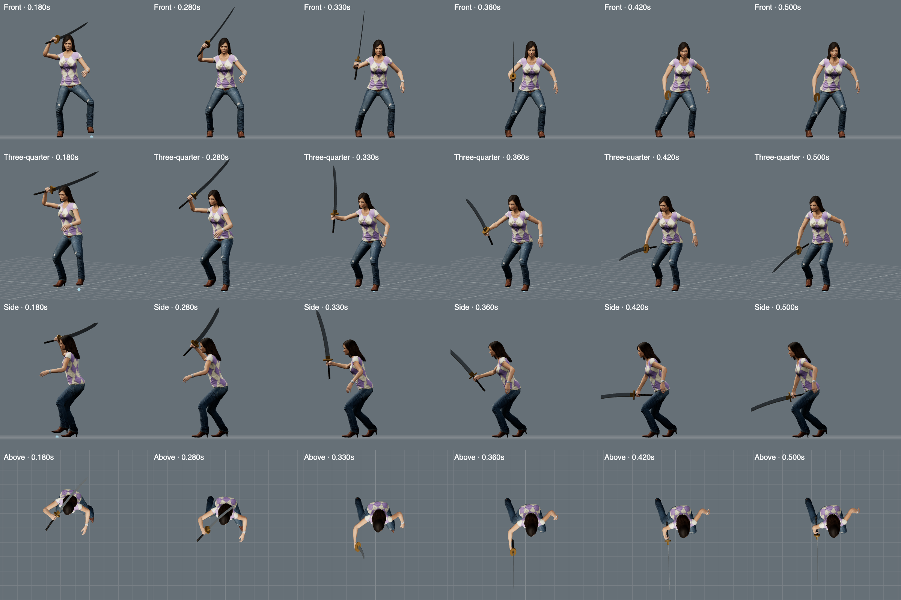

# The Hustler heavy cleave

The previous heavy cleave kept its feet and hips almost still. Its arm poses also matched the first light attack.
The revised clip adds a rear load, a left step, hip rotation before the shoulders, and a downward follow-through.
The rear foot turns around its planted toe. The character transfers her weight back before returning the lead foot.
The free arm moves with the attack. Both ends match the existing Ready pose, including every finger.



Only `Ring_Heavy_Cleave` changes. Its hit remains at 0.36 seconds. Recovery extends its duration from 0.76 to 1.06 seconds.
The running carry ends after 0.14 seconds. The previous 0.26-second carry transition crossed the hair during the raised chamber.
The fixed weapon grip, model geometry, materials, skin bindings, and all 36 other animation clips remain unchanged.
This includes both golf clips and their closed hand grips.

## Measurements

The measurements describe the exported rig. They do not establish finished visual quality.

| Check | Result |
| --- | ---: |
| Lead step | 38.0 cm |
| Lead foot lift | 7.50 cm |
| Rear heel lift | 3.71 cm |
| Minimum stance width | 44.0 cm |
| Pelvis projection toward lead foot, load / strike | 30.6% / 70.7% |
| Forward torso lean at strike | 21.6° |
| Pelvis turn ahead of chest during drive | 16.2° |
| Support drift | 0.011 mm |
| Final joint position / rotation error against Ready | 0.016 mm / 0.0019° |
| Native wrist rotation | 16.0° maximum |

The pelvis projection is a positional proxy. It is not a calculated whole-body center of mass.
A 480 Hz inspection passes 511 arm samples, with no measured arm folds or arm/torso crossings.
The actual weapon meshes clear the weighted head, torso, and leg surfaces in 510 samples.
The minimum measured gaps are 15.5 mm at the head, at least 30 mm at the torso, and 20.6 mm at the legs.
The body scan excludes the hands and arms. Separate grip and arm checks cover those regions.

The browser checks the actual blade against the skinned head after carry and animation blending.
Fifteen entries cover idle, guard, repeated attacks, four running directions, and three running phases.
All 3,840 samples have zero crossings and at least 17.0 mm clearance.
The sword stays at its fitted palm station. Both wrists stay below 16 degrees.
The carry also passes the existing movement continuity limits at 60, 120, and 240 Hz.

## Independent review

Claude Opus 5.5 at High effort reviewed the baseline screenshots and arm profile.
It identified the stationary lower body and shared light-attack poses.
It recommended moderate rotation, a lead step, a rear toe pivot, and a downward follow-through.
The follow-up review uses actual game renders from four angles, plus the full recovery sequence.
[The follow-up review](hustler-heavy-body-opus.md) accepts the candidate, subject to head and leg clearance checks. Both checks pass.
The review uses stills. It cannot establish all motion between those stills.
The four-angle side view uses +X; the full-sequence side view uses −X.
The reviewer missed the rear-foot pivot. The native measurements verify its 32-degree rotation.

## Reproduction

The source baseline is commit `e23763fa6722c4553064ac47b36fef1bdf77c63d`.
Extract its `public/models/ayame.glb` and `src/motion-data.json` into a temporary directory.
Then run:

```sh
node tools/author-native-hustler-body.mjs \
  --model /tmp/hustler-baseline.glb \
  --record /tmp/hustler-baseline-motion.json \
  --output /tmp/hustler-candidate.glb \
  --output-record /tmp/hustler-candidate.json

HUSTLER_BODY_MODEL=/tmp/hustler-candidate.glb \
HUSTLER_BODY_RECORDS=/tmp/hustler-candidate.json \
node --test tests/native-hustler-body.test.js

HUSTLER_BODY_MODEL=/tmp/hustler-candidate.glb \
HUSTLER_BODY_RECORDS=/tmp/hustler-candidate.json \
node tests/browser-hustler-body.mjs
```

The browser check needs the local Vite server on port 5173. It keeps audio muted.
The author rejects an already modified input model and writes candidates outside `public/`.
It verifies all 36 unrelated clips and 10,268,516 original binary bytes.

## Release validation

All 420 unit and geometry tests pass in the clean release snapshot. The production build passes.
The browser passes 96 moving attacks, grounded support checks, combat timing, and the new head-clearance regression.
Golf checks pass 150 phases, both hand grips, 12 finite driver/putter contacts, and all eight club selections across six heroes.

The broader attack-transition test retains existing failures for Ethan's interrupted, repeated polearm attacks.
The primary palm gaps reach 3.912 mm for light and 10.998 mm for heavy, against a 2 mm limit.
The unchanged Ethan model reproduces both results. These separate defects remain open. The Hustler's tested attack entries retain the weapon at the palm within numerical precision.
