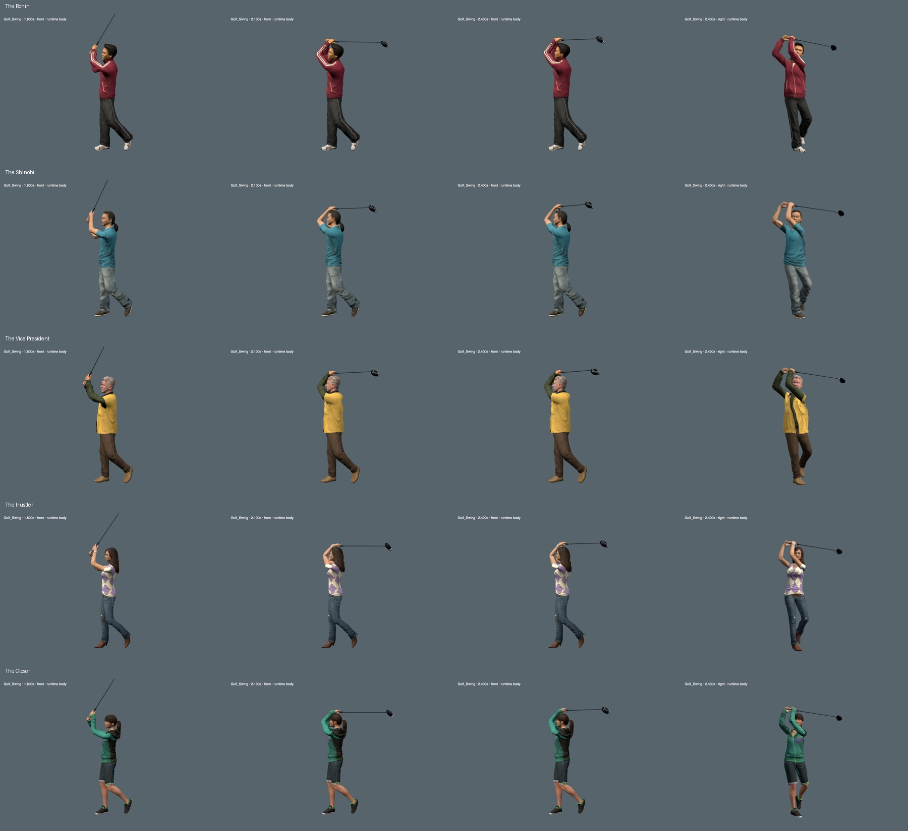
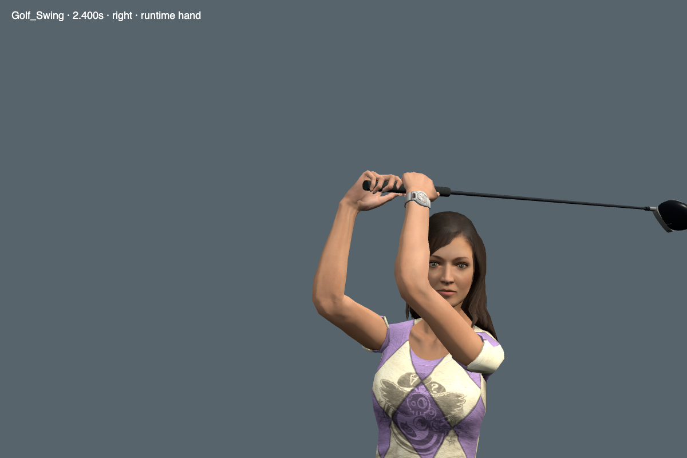

# Roster golf finishes

The Ronin, Shinobi, Vice President, Hustler, and Closer now complete the swing with folded elbows and a fuller chest turn.
Their clubs settle behind the head. Their previous finishes stopped with the shaft raised in front.
The Ace retains its previously reviewed finish and grasp.

Each row shows 1.8, 2.1, and 2.4 seconds from the front, then the final pose from the side.

[Ronin runtime swing at normal speed](media/roster-golf-finish-ronin.webm)

## Fitting

The accepted Ace finish supplies the starting pose reference.
Each fit accounts for that character's arm lengths, native bone frames, and existing paired grip.
Both hands stay on one shared club frame.
The elbow solver uses the native bend direction and constrains wrist flexion and arm rotation.
The chest opens another 20 degrees across two joints while the head retains its original world rotation.

The correction begins after 1.68 seconds and reaches its final target by 2.24 seconds.
The Vice President finishes this fold at 2.18 seconds to reduce late club movement.
His shaft travels 19.8 degrees during the final hold, within the existing 20-degree settling limit.
The fitting bounds grow gradually at the transition. Forearm rotation also starts from the existing pose.
This removed a sharp initial arm adjustment from the first candidate.
A later sleeve check found excessive elbow folding on the Ronin and Vice President.
Their final fits reduce that fold and pass the original limits.
A 120 Hz scan finds no radial overlap on the Ronin and at most 12.1 mm on the Vice President.
The Vice President result remains within the existing 18 mm crease allowance; it does not mean zero sleeve overlap.
No fitting runs during gameplay; the assets contain the resulting animation curves.

## Verification

- Dense joint and paired-grip checks pass for all five models, with about 6,600 samples per model.
- The largest full-swing paired-hand position error is below 0.15 mm.
- Complete head, limb, hand, grip, and shaft surfaces pass more than 1,070 finish samples per model.
- Those surface scans find no crossings and retain at least 5 mm head clearance.
- All ten fingers retain contact with the finite handle over 181 sampled golf poses per character.
- The hand and finger surfaces do not cross each other. Handle penetration remains below the existing 1.5 mm tolerance.
- Peak elbow speed after 1.8 seconds stays below 3 m/s for every revised character.
- The builder reproduces each reviewed model exactly and checks both source and output hashes.

The change replaces eleven rotation channels per model.
It preserves 41,479 other animation channels and each source model's complete binary payload.
Geometry, skin weights, materials, finger profiles, leg motion, address, ball contact, and club lengths remain unchanged.
The maximum early-swing difference is below 0.00005 degrees from float conversion.
Each model grows by about 262 KB.

The saved curves and rebuild instructions are in [tools/golf-finish](../../tools/golf-finish/README.md).

## Independent review and remaining limits

Claude Opus 5.5 High reviewed the original finishes, the candidates, sampled runtime frames, and close hand and shoulder views.
All responses identified the actual model as `claude-opus-5-5` and reported no permission denials.
It judged the update an incremental improvement with no visible anatomical regression that should block release.
It did not assess motion smoothness from still images.

The finishes still hold the club high, near crown height, instead of wrapping it lower around the shoulders.
The Hustler has the weakest finish: the arms look too symmetric, and the raised shoulder reveals angular sleeve deformation.
The close review found no holes, skin crossing the cloth, or collapsed shoulder volume.
The deformation remains visible and needs a later shoulder-weight or pose correction.
A final review also accepted the Ronin and Vice President sleeve corrections.

The Ronin uses a ten-finger grasp without overlap or interlock.
A small exposed section of handle between adjacent fingers does not indicate separated hands.
The grip still needs finer finger posing to look convincing at extreme close range.
Some side angles hide part of the face behind the trail forearm.
The final hold is quiet and could use more natural settling.
These checks establish a tested improvement, not finished animation quality.

## Runtime checks

Browser checks pass 150 golf phases, twelve clubface contacts, all eight clubs, and 108 golf leg frames.
All six preview cycles pass, including the C console, speed control, pause, and resume.
Camera framing passes ten desktop layouts and all four course themes.
The normal-speed Ronin capture averaged 60.8 FPS in the isolated two-camera scene.
This measures one local preview, not full-course combat performance.

The release pipeline runs the full unit suite before publishing.
